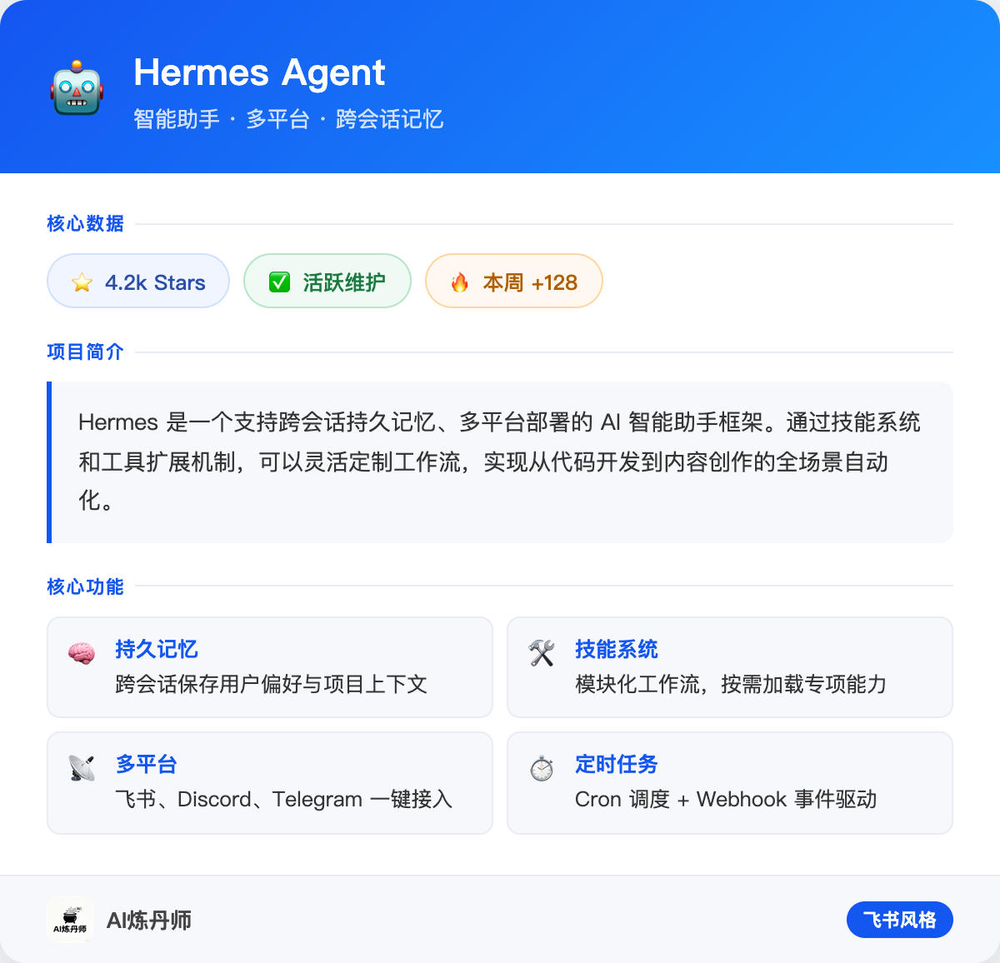
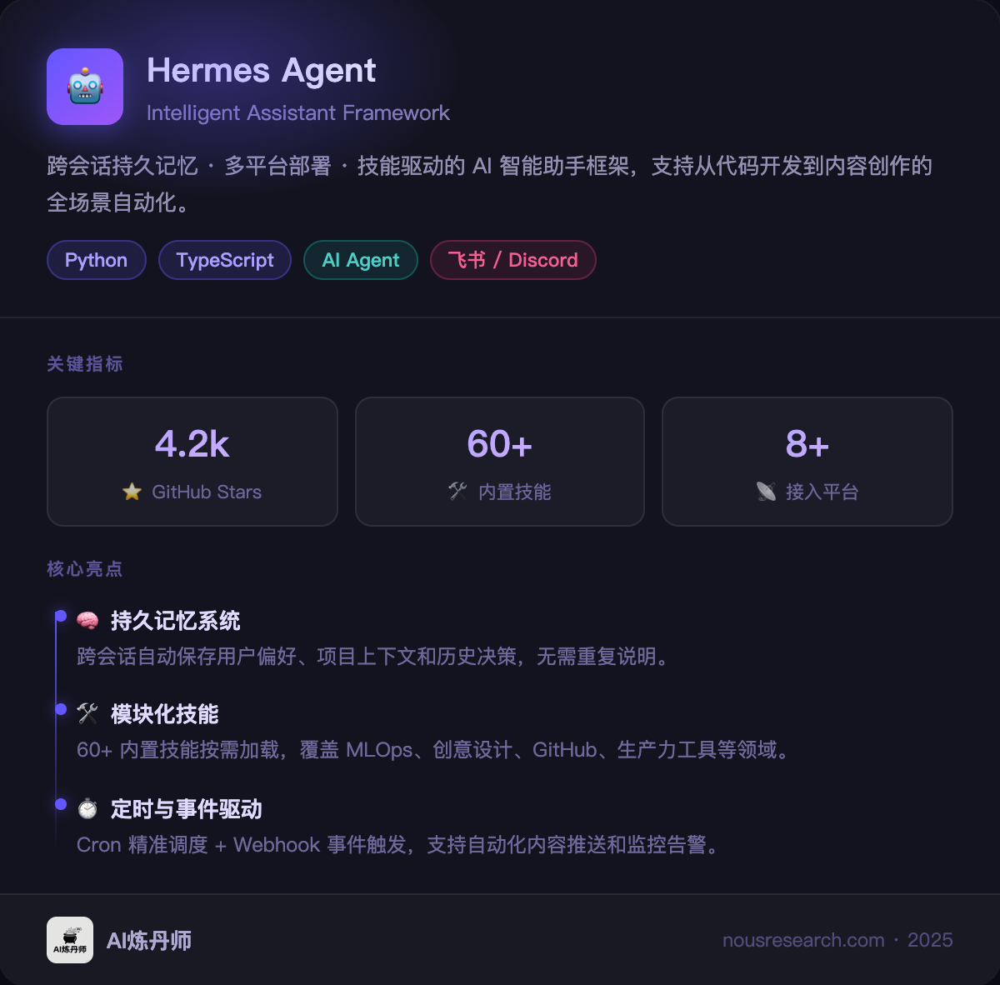

# feishu-style-card-image

> 🃏 一个 Hermes Agent Skill —— 把任意结构化信息渲染成飞书风格的卡片图片，输出高分辨率 PNG。


---

## 是什么

这是一个 [Hermes Agent](https://github.com/NousResearch/hermes-agent) Skill。

只需告诉 AI「帮我做成卡片图片」，它就会：

1. 把你提供的内容（GitHub 库介绍、文章总结、工具对比等）自动排版
2. 生成一份飞书风格的 HTML 卡片
3. 用 Puppeteer 截图输出 **2x 高清 PNG**，直接发给你

技术栈：**纯 HTML + CSS → Puppeteer 截图**，无需外部图片服务。

---

## 效果预览

支持两种风格，按场景选用：

### 风格一：飞书蓝亮色

适合正式汇报、产品介绍、GitHub 库展示。



### 风格二：暗黑科技紫

适合技术展示、夜间阅读、科技感内容。



---

卡片包含以下可选区块，按内容按需组合：

| 区块 | 说明 |
|------|------|
| 🎨 Header | 蓝色渐变标题栏 + emoji 图标 |
| 🔗 来源行 | 仓库地址或文章链接 |
| 📊 Stats 徽章 | Stars / Forks / 日期等数值（蓝/绿/橙三色） |
| 📝 描述块 | 蓝色左边框的核心说明段落 |
| ⚡ 安装命令 | 深色背景命令行 |
| 💻 代码示例 | Catppuccin Mocha 主题语法高亮 |
| 🚀 功能网格 | 双列特性卡片 |
| 📎 Footer | 品牌 logo + 名称 + 链接 |

---

## 安装

将 `SKILL.md` 放入你的 Hermes Agent skills 目录：

```bash
# 克隆仓库
git clone https://github.com/happydog-intj/feishu-style-card-image.git

# 复制 skill 到 Hermes skills 目录
cp feishu-style-card-image/SKILL.md ~/.hermes/skills/creative/feishu-style-card-image/SKILL.md
```

或者直接创建目录并复制：

```bash
mkdir -p ~/.hermes/skills/creative/feishu-style-card-image
curl -o ~/.hermes/skills/creative/feishu-style-card-image/SKILL.md \
  https://raw.githubusercontent.com/happydog-intj/feishu-style-card-image/main/SKILL.md
```

---

## 依赖

- [Hermes Agent](https://github.com/NousResearch/hermes-agent)
- [Puppeteer](https://pptr.dev/)（通过 Homebrew 安装：`brew install puppeteer`，或 `npm install -g puppeteer`）
- macOS 推荐（系统自带 PingFang SC 字体，中文显示完美）

---

## 使用方式

安装 skill 后，在 Hermes Agent 对话中直接说：

```
帮我把这个内容做成飞书风格的卡片图片发给我
```

触发词：
- `帮我做成卡片图片`
- `飞书风格卡片`
- `生成信息卡片图片`
- `做成图片发给我`

---

## 设计规范

### 颜色系统

```css
/* 主色 */
--blue-primary: #1456F0;
--blue-light:   #f0f5ff;

/* 代码块 Catppuccin Mocha */
--code-bg: #1e1e2e;
--kw: #cba6f7;  /* keyword  - 紫 */
--fn: #89b4fa;  /* function - 蓝 */
--st: #a6e3a1;  /* string   - 绿 */
--cm: #6c7086;  /* comment  - 灰 */
```

### 输出规格

- 卡片宽度：600px（固定）
- 截图分辨率：2x（实际输出 1200px 宽）
- 格式：PNG

---

## 适用场景

- ✅ GitHub 库/工具介绍
- ✅ 文章核心要点总结
- ✅ 产品/功能对比
- ✅ 技术报告摘要
- ❌ 小项目（几行文字直接发就好，不需要卡片）

---

## License

MIT
